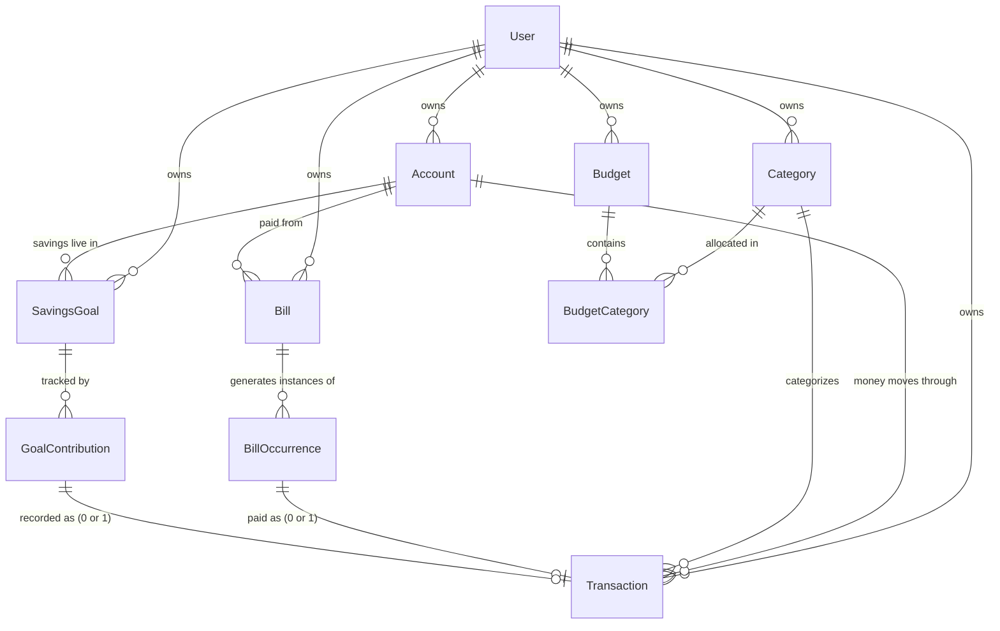

# Data Model

Source of truth: [`apps/api/prisma/schema.prisma`](../../apps/api/prisma/schema.prisma). This document explains the _why_ behind the shape of that schema — read the schema file itself for exact field types/defaults.

Every table below carries a required `userId`, even though the product is currently single-user (ADR-003). Money is always an integer count of minor units (e.g. cents) plus an explicit `currency` — never a float (ADR-002).

## Entity Relationship Overview

## User

Single seeded system user for MVP (ADR-003). `id` is a fixed constant (`SYSTEM_USER_ID` in `apps/api/prisma/seed.ts`) so "resolve current user" is a one-line stub today, swapped for real auth later without touching the schema.

## Account / Category — Archive, Don't Delete

Both carry `isArchived`. Per ADR-008: hard delete is permitted only when zero transactions reference the row; once referenced, the row is archived (hidden from pickers, preserved on history) instead. The `Restrict` `onDelete` behavior on every FK pointing at `Account`/`Category` enforces this at the database level too, as a safety net if application logic ever gets it wrong.

`Category` has a `@@unique([userId, name])` constraint — one category per name per user. Renaming is always allowed (ADR-008); this constraint doesn't block renames, only exact-name collisions.

## Transaction — Single Source of Truth

Every dollar that moves is a `Transaction` row: manual entries, bill payments, and goal contributions alike (ADR-005). `relatedBillOccurrenceId` and `relatedGoalContributionId` are nullable, unique foreign keys — set exactly when a `Transaction` was generated by marking a bill paid or recording a contribution, respectively. Reports, dashboards, and account balances only ever need to query `Transaction` — never a union across three tables.

`transactionDate` is `@db.Date` (no time component) — deliberately, per plan Section 51's rule that a date and a timestamp are not interchangeable.

`idempotencyKey` + the `@@unique([userId, idempotencyKey])` constraint implement ADR-007: Postgres treats `NULL` as distinct from every other `NULL` in a unique constraint, so transactions created without a key (internal ones, like bill/goal-linked transactions) never collide with each other — only a genuine repeated key for the same user is rejected.

## Budget / BudgetCategory

`period` (`WEEKLY` / `FORTNIGHTLY` / `MONTHLY`) + `anchorDate` implement ADR-006 — periods are computed by walking forward from the anchor, not aligned to calendar months.

A `Budget` is either an overall cap (`totalAmountMinorUnits` set, no `BudgetCategory` rows) or a per-category budget (one or more `BudgetCategory` rows, `totalAmountMinorUnits` null). This isn't enforced by a DB constraint — it's a service-layer invariant to validate when the Budget API is built (Phase 7).

## Bill / BillOccurrence

Split per plan Section 19: `Bill` is the recurring definition (name, normal amount, recurrence cadence), `BillOccurrence` is one due-date instance, which can differ from the bill's normal amount.

`BillOccurrence.paymentStatus` stores only `PENDING` / `PAID` / `SKIPPED` — the real, user-driven states. The plan's other statuses (`UPCOMING`, `DUE_SOON`, `DUE_TODAY`, `OVERDUE`) are time-relative and are computed at read time by the API from `dueDate` vs. today, never persisted — see **ADR-010**.

## SavingsGoal / GoalContribution

`SavingsGoal` deliberately has **no stored `currentAmountMinorUnits`** — progress is always computed by summing `GoalContribution` rows for that goal. A cached running total would be a second source of truth that could drift if a contribution is ever edited or deleted; summing is cheap and always correct (plan Section 55 — avoid premature caching).

`status` (`ACTIVE` / `COMPLETED` / `ARCHIVED`) supports the Phase 10 "archive/complete goal" task.

## Indexes

Per plan Section 55's likely-useful-indexes guidance, now built in rather than deferred:

- `transactions(userId, transactionDate)`
- `transactions(userId, categoryId, transactionDate)`
- `bill_occurrences(userId, dueDate)`
- `savings_goals(userId, status)`

Query plans should still be validated against real usage before adding further indexes — this list isn't exhaustive, just the ones the plan already called out as likely.

## Deliberately Not Modeled Yet

- **`RecurringRule`, `Tag`/`TransactionTag`** — listed as "initial entities" in the plan (Section 17) but not called for by Phase 2's own task checklist. Bill recurrence is handled by a simple `BillRecurrence` enum on `Bill` for now; a generalized recurring-rule concept (also covering recurring income) can be introduced when Phase 8's occurrence-generation logic actually needs it, rather than built speculatively now.
- **`Household`, `BankConnection`, `ImportedTransaction`, `Notification`, `Receipt`, `AuditEvent`** — explicitly later-phase entities per the plan (Section 17); not part of MVP scope.

## Migrations

| Migration                                      | Purpose                                                                                                        |
| ---------------------------------------------- | -------------------------------------------------------------------------------------------------------------- |
| `20260814105356_init`                          | Initial schema — all Phase 2 tables.                                                                           |
| `20260814110000_category_name_unique_per_user` | Adds `@@unique([userId, name])` on `Category`, required for the seed script's upsert to be safely re-runnable. |

Seed data (`apps/api/prisma/seed.ts`): the fixed system user plus the 15 default categories from plan Section 3. Run via `pnpm --filter @budget-terry/api run db:seed`; safe to re-run (upserts, not inserts).
